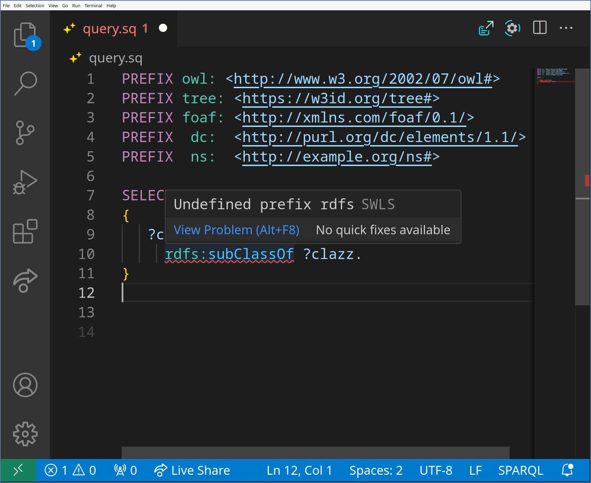
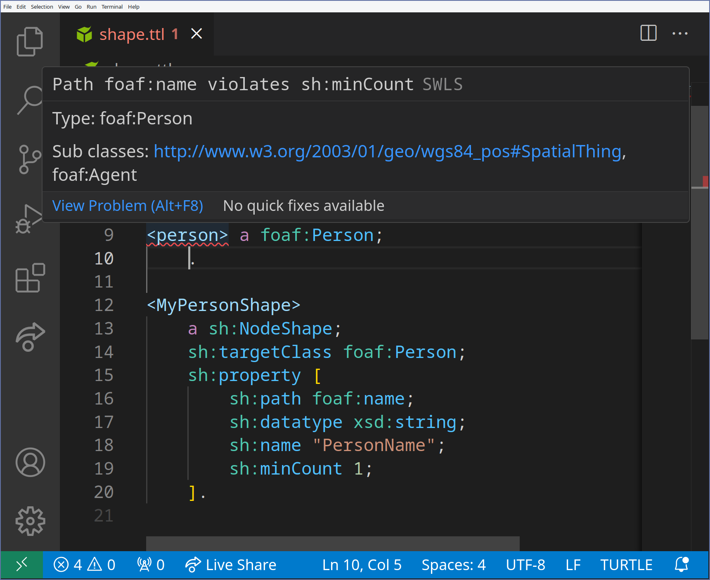
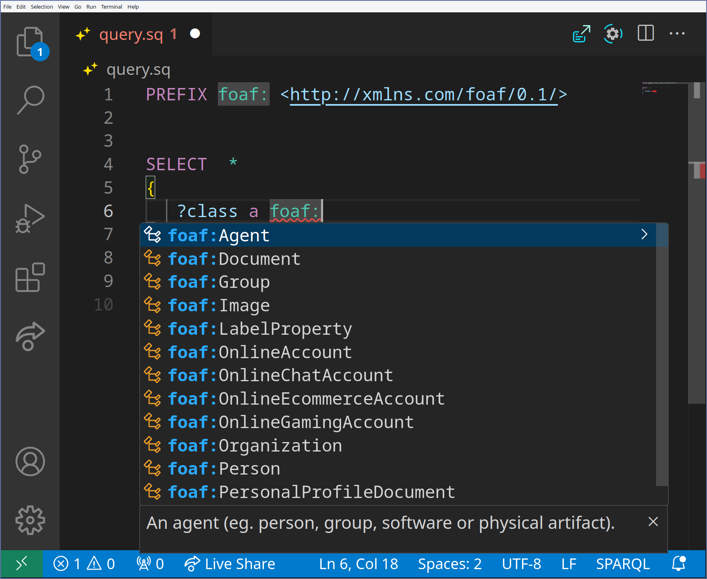
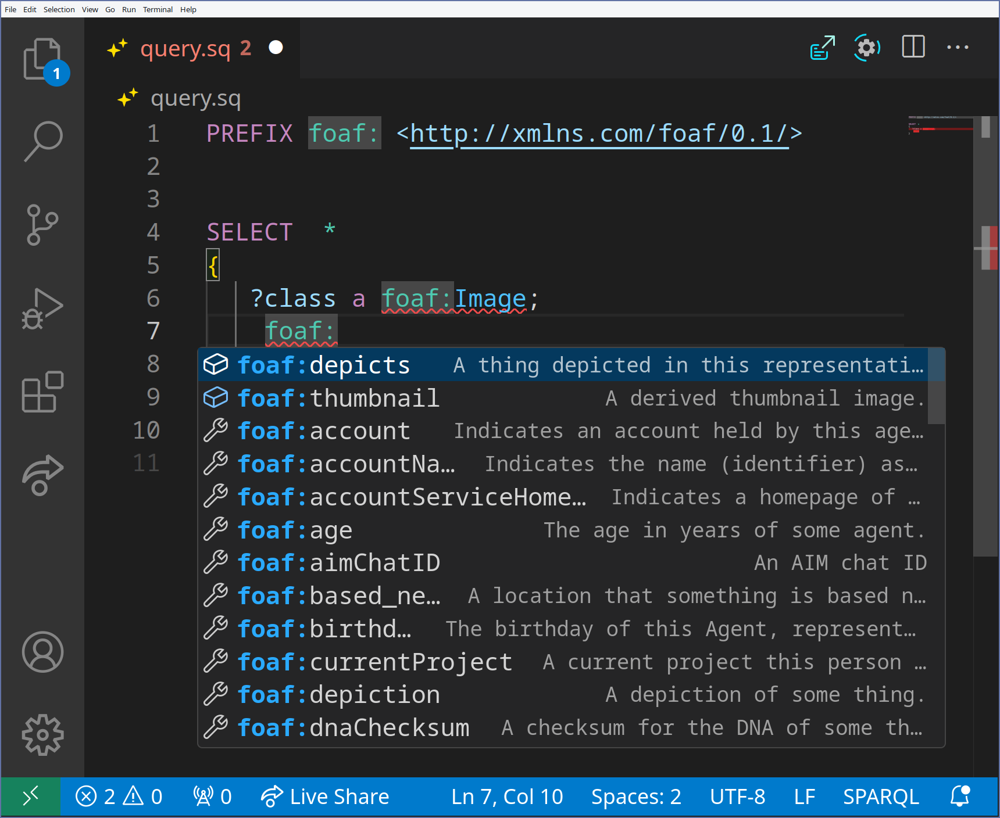

# Semantic Web Language Server

[](https://github.com/SemanticWebLanguageServer/swls/actions/workflows/ci.yml)
[](https://semanticweblanguageserver.github.io/swls/docs/swls_core/index.html)

[](https://marketplace.visualstudio.com/items?itemName=ajuvercr.semantic-web-lsp)

**SWLS** is a Language Server Protocol (LSP) server that brings IDE-like tooling — diagnostics,
completion, hover, navigation, refactoring, formatting and highlighting — to Semantic Web
languages: **Turtle**, **TriG**, **JSON-LD** and **SPARQL**.

Try it instantly, no install required: **[live demo](https://semanticweblanguageserver.github.io/swls/)** (Monaco editor in the browser).

## Install

| Editor | How |
|---|---|
| **VS Code** | Install from the [Marketplace](https://marketplace.visualstudio.com/items?itemName=ajuvercr.semantic-web-lsp) ([source](https://github.com/SemanticWebLanguageServer/swls-vscode)) |
| **NeoVim** | Use the [swls.nvim](https://github.com/SemanticWebLanguageServer/swls.nvim) plugin |
| **JetBrains** | Install from the JetBrains Marketplace ([source](https://github.com/SemanticWebLanguageServer/swls-jetbrains)) |
| **Anything else** | Any LSP-capable editor can run the `swls` binary directly — see [Other editors](#other-editors) |

Details and caveats for each editor are in [Installation](#installation) below.

## Features

| Category | What you get |
|---|---|
| **Diagnostics** | Syntax errors · undefined-prefix errors · unused-prefix warnings · unknown-property-in-closed-namespace warnings · SHACL shape violations |
| **Completion** | Keywords (`@prefix`, `@context`, ...) · prefix names (from bundled LOV/prefix.cc data) · classes · domain-aware properties · cross-document subjects (Turtle) · Components.js parameters (JSON-LD) |
| **Hover** | Inferred RDF type · class & property documentation from the ontology · explanation when a property is only accepted via your allow-list |
| **Navigation** | Go to definition (RDF terms and, for JSON-LD, Components.js modules/parameters) · go to type definition · find references · rename |
| **Code actions** | Add missing prefix declaration · allow-list an unknown property · organize/sort `@prefix` imports (Turtle) · extract/inline a blank node |
| **Formatting** | Document formatting for Turtle and JSON-LD · auto-insert the prefix declaration while typing |
| **Highlighting** | Semantic syntax highlighting |
| **Inlay hints** | Inferred type shown inline next to subjects missing an explicit `rdf:type` |

Every diagnostic and almost every feature above can be **individually enabled or disabled** —
see [Configuration](#configuration).

## Installation

Currently a fluent install is possible for NeoVim and VS Code. Since SWLS speaks the standard
Language Server Protocol, it can be wired into any editor with an LSP client — see
[Other editors](#other-editors) if yours isn't listed below.

### VS Code

There is a VS Code extension available in the [Marketplace](https://marketplace.visualstudio.com/items?itemName=ajuvercr.semantic-web-lsp).
Source: [SemanticWebLanguageServer/swls-vscode](https://github.com/SemanticWebLanguageServer/swls-vscode).

### JetBrains

There is a JetBrains plugin available in the [JetBrains Marketplace](https://plugins.jetbrains.com/plugin/27501-swls--turtle-trig-sparql--json-ld-language-server).
Source: [SemanticWebLanguageServer/swls-jetbrains](https://github.com/SemanticWebLanguageServer/swls-jetbrains).

### NeoVim

A NeoVim plugin is available at [SemanticWebLanguageServer/swls.nvim](https://github.com/SemanticWebLanguageServer/swls.nvim).

### Other editors

SWLS is a standard LSP server (stdio transport), so any editor with a generic LSP client
(Sublime Text, Helix, Emacs `lsp-mode`/`eglot`, Kate, ...) can run it directly. Grab the `swls`
binary from the [latest release](https://github.com/SemanticWebLanguageServer/swls/releases) and
point your editor's LSP client at it for `.ttl`, `.trig`, `.jsonld` and `.sparql`/`.rq` files.

## Configuration

SWLS reads configuration from the client's `initializationOptions`, plus optional
`.swls/config.json` (workspace) and `~/.config/swls/config.json` (global) files.

```json
{
  "turtle": true,
  "sparql": false,
  "disabled": ["unused_prefix", "hover_excluded_property"]
}
```

- `turtle` / `trig` / `jsonld` / `sparql` (default `true`) — enable/disable a language plugin entirely.
- `disabled` — a list of individual diagnostics or LSP (sub-)features to turn off, e.g. just the
  "unused prefix" warning, or just hover-on-class without touching the rest of hover.

## Documentation

- [swls-core](https://semanticweblanguageserver.github.io/swls/docs/swls_core/index.html)
- [swls-lang-turtle](https://semanticweblanguageserver.github.io/swls/docs/swls_lang_turtle/index.html)
- [swls-lang-trig](https://semanticweblanguageserver.github.io/swls/docs/swls_lang_trig/index.html)
- [swls-lang-jsonld](https://semanticweblanguageserver.github.io/swls/docs/swls_lang_jsonld/index.html)
- [swls-lang-sparql](https://semanticweblanguageserver.github.io/swls/docs/swls_lang_sparql/index.html)
- [swls (binary)](https://semanticweblanguageserver.github.io/swls/docs/swls/index.html)

## Screenshots

|Undefined prefix|Shape violation|
|---|---|
|  |  |

|Complete Class|Complete Property|
|---|---|
|  |  |

## Citation

When using the Semantic Web Language Server, please use the following citation:

> A. Vercruysse, J. A. Rojas Melendez, and P. Colpaert, “The semantic web language server : enhancing the developer experience for semantic web practitioners,” in The Semantic Web : 22nd European Semantic Web Conference, ESWC 2025, Proceedings, Part II, Portoroz, Slovenia, 2025, vol. 15719, pp. 210–225.

Bibtex:
```bibtex
@inproceedings{SWLS,
  author       = {{Vercruysse, Arthur and Rojas Melendez, Julian Andres and Colpaert, Pieter}},
  booktitle    = {{The Semantic Web : 22nd European Semantic Web Conference, ESWC 2025, Proceedings, Part II}},
  editor       = {{Curry, Edward and Acosta, Maribel and Poveda-Villalón, Maria and van Erp, Marieke and Ojo, Adegboyega and Hose, Katja and Shimizu, Cogan and Lisena, Pasquale}},
  isbn         = {{9783031945779}},
  issn         = {{0302-9743}},
  language     = {{eng}},
  location     = {{Portoroz, Slovenia}},
  pages        = {{210--225}},
  publisher    = {{Springer}},
  title        = {{The semantic web language server : enhancing the developer experience for semantic web practitioners}},
  url          = {{http://doi.org/10.1007/978-3-031-94578-6_12}},
  volume       = {{15719}},
  year         = {{2025}},
}
```

## Support

If SWLS helps your workflow, consider supporting development:

☕ https://ko-fi.com/ajuvercr

## License

Copyright &copy; 2025, IMEC - IDLab - UGent.
Released under the [MIT License](LICENSE).
